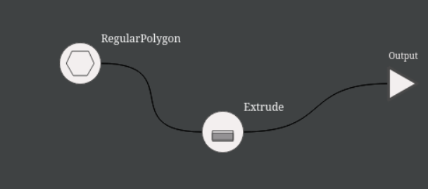

# Atom Recalculation Summary

This document summarizes the implementation of how and when atoms are recalculated in Abundance.

## Design overview

A full design doc is here: https://docs.google.com/document/d/1LBNbkE_WcWTdFPFDtd_dr6WH83iH5nmVkMmBUIOyE88/edit?usp=sharing.

Bellow is an abbreviated summary angled towards developers.

Under the current design (August 2025) each entity  (`Atom` or `AttachmentPoint`) in the user's flow canvas
inherits from `ObservableEntity`. This provides two important behaviors:

1. Each entity has state composed of a `status` and an optional `value`
2. All entities can be subscribed to, and will notify their subscribers whenever their `status` or `value` change.

Each entity subscribes to it's inputs, by convention with it's `onUpstreamChange` method. When necessary an entity will update itself by calling an appropriate helper from `ObservableEntity` eg: `setReady(value)`, `setError(message)`, `setWaiting` etc.

The `onUpstreamChange` method in `atom.js` is typically sufficient, it checks if all inputs are in a `READY` status and if so calls `compute` with a dictionary of `{inputName: inputValue}`. All other statuses are handled within `onUpstreamChange`

Available statuses:

1. `READY` - default color - indicates a value is set and up to date
2. `PROCESSING` - dark blue - inputs are ready but this entity hasn't finished computing it's own value.
3. `WAITING` - light blue - not all inputs are ready yet, either in a PROCESSING or WAITING state.
4. `ERROR` - red - our inputs are ready but something went wrong in this entity and it could not complete a computation.
5. `UPSTREAM_ERROR` - yellow - this entity cannot be computed because one or more input is in `ERROR` or `UPSTREAM_ERROR` status.
6. `DISABLED` - purple - an unresponsive state where updates are ignored. All atoms start in this state during construction, but should be changed to a different state before they become visible to the user.

## Example

Consider how a small change is handled in this example project:

Let's say a user changes the number of sides on the RegularPolygon to `3`. This is handled by RegPolygon's AttachmentPoint which calls `setReady(3)` in response to the LevaInput change.

The AP was already in status `READY` but it's `value` has changed so it's subscribers are notified*. In this case that's just the RegPolygon atom itself.

All of RegularPolygon's inputs are `READY` so changes it's status to `PROCESSING` and kicks off an async task to generate the new polygon. Because it's state has changed it's subscribers are notified.

Extrude's Geometry AP is the only subscriber to RegularPolygon, it's status is updated to `WAITING` since one of it's inputs is in the `PROCESSING` status. In turn, Extrude atom, Output AP and the Output atom area each notified of a change and enter the `WAITING` status.

Eventually RegPolygon's async computation will complete and it will update into a `READY` status. This gets passed down the line to Extrude which enters a `PROCESSING` status. Etc.

### Control Flow:

Conceptually, each change triggers a fast response (eg: all downstream entities become WAITING) and a slower response, after each async task atoms become READY one by one. It is therefore critical that `onUpstreamChange` be fast (since it's in the fast-response path) and heavy computation be asynchronous (therefore in the slow-response path).

\* technically transitions from READY -> READY are implemented as READY -> PROCESSING -> READY. See note in `ObservableEntity`
